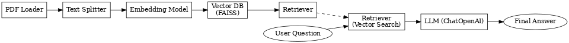

# 🧠 RAG System Architecture Overview

This document describes the internal architecture of a simple Retrieval-Augmented Generation (RAG) system implemented using LangChain in Python.

It explains the components involved, their responsibilities, and how they are connected in a clean two-phase workflow:
- **1. Indexing phase**
- **2. Querying phase**

---

## ⚙️ 1. Indexing Phase – preparing the knowledge base

This phase runs once (or whenever documents are updated). It prepares documents to be queried later via a vector-based search.

### 🔹 1.1 Document Loader

**Purpose:** Load raw source files into LangChain-compatible `Document` objects.

- In our case: a single `.pdf` file using `PyPDFLoader`
- Each page of the PDF becomes one `Document` object

```python
from langchain.document_loaders import PyPDFLoader
documents = PyPDFLoader("path/to/file.pdf").load()
```

### 🔹 1.2 Text Chunking
**Purpose:** Split documents into smaller chunks for granular semantic search.<br>
Each chunk should be ~500 characters long with overlap to preserve context.
- Tool used: `RecursiveCharacterTextSplitter`
- Operates per `Document`
```python
splitter = RecursiveCharacterTextSplitter(chunk_size=500, chunk_overlap=100)
chunks = splitter.split_documents(documents)
```

### 🔹 1.3 Embedding Generation
**Purpose:** Convert each chunk of text into a high-dimensional vector using a pretrained model.
- Used: `OpenAIEmbeddings` (can be swapped with HuggingFace, Cohere, etc.)
- The same model is used later during retrieval
```python
embedder = OpenAIEmbeddings()
embeddings = embedder.embed_documents([chunk.page_content for chunk in chunks])
```

### 🔹 1.4 Vector Store Creation
**Purpose:** Store chunk vectors in a searchable index using similarity metrics.
- Used: `FAISS` (local in-memory vector database)
- Exposes a `.as_retriever()` method used later in querying

```python
vectorstore = FAISS.from_documents(chunks, embedder)
retriever = vectorstore.as_retriever()
```

---

## 🤖 2. Querying Phase – answering questions with retrieved context
This phase is executed every time the user asks a question. <br>
It uses the indexed data to find relevant context, then lets the LLM generate the answer.

### 🔹 2.1 User Input
The user provides a natural language question:
```python
question = "What is a function in Python?"
```

### 🔹 2.2 Retrieval (Vector Search)
**Purpose:** Convert question into an embedding and find similar chunks in the vector store.
```python
retrieved_docs = retriever.get_relevant_documents(question)
```

### 🔹 2.3 Prompt Construction & Chain
**Purpose:** Combine user question + retrieved context into a single prompt for the LLM.
- Used: `RetrievalQA.from_chain_type()`
- Chain type: `stuff` = all chunks are stuffed into the same prompt
```python
llm = ChatOpenAI()
qa_chain = RetrievalQA.from_chain_type(
    llm=llm,
    chain_type="stuff",
    retriever=retriever
)
```

### 🔹 2.4 LLM Answer Generation
**Purpose:** Generate the final response using an LLM with the retrieved context.
```python
answer = qa_chain.run(question)
```

---

LangChain handles:
- fetching relevant chunks
- formatting the prompt
- running inference
- returning the answer

## 🔁 Summary: RAG Flow Diagram
```
1. INDEXING
   ┌────────────┐
   │ PDF Loader │──▶ Documents
   └────────────┘
         │
         ▼
   ┌───────────────┐
   │ Text Splitter │──▶ Chunks
   └───────────────┘
         │
         ▼
   ┌──────────────────┐
   │ Embedding Model  │──▶ Vectors
   └──────────────────┘
         │
         ▼
   ┌────────────┐
   │ Vector DB  │──▶ Retriever
   └────────────┘

2. QUERYING
   ┌──────────────┐
   │ User Question│
   └──────────────┘
         │
         ▼
   ┌────────────┐
   │ Retriever  │──▶ Relevant Chunks
   └────────────┘
         │
         ▼
   ┌────────────┐
   │ LLM (QA)   │──▶ Answer
   └────────────┘
```


---

## ✅ Key Concepts Recap

| **Component**     | **Role**                                             |
|---------------|--------------------------------------------------|
| Loader        | Loads source data into documents                 |
| Splitter      | Splits documents into retrievable chunks         |
| Embeddings    | Transforms text into vector representations      |
| Vectorstore   | Stores embeddings and supports similarity search |
| Retriever     | Finds similar chunks to a given question         |
| LLM Chain     | Formats prompt + generates answer                |


---

## 🧩 Notes
- This system uses OpenAI embeddings and OpenAI GPT as LLM
- Retrieval is purely vector-based, but can be hybridized
- Chain type "stuff" works best for short contexts; "map_reduce" is better for long docs

---
Created by [Peter Baksa] • 2025
This document is part of the internal architecture notes for a LangChain-based RAG system.